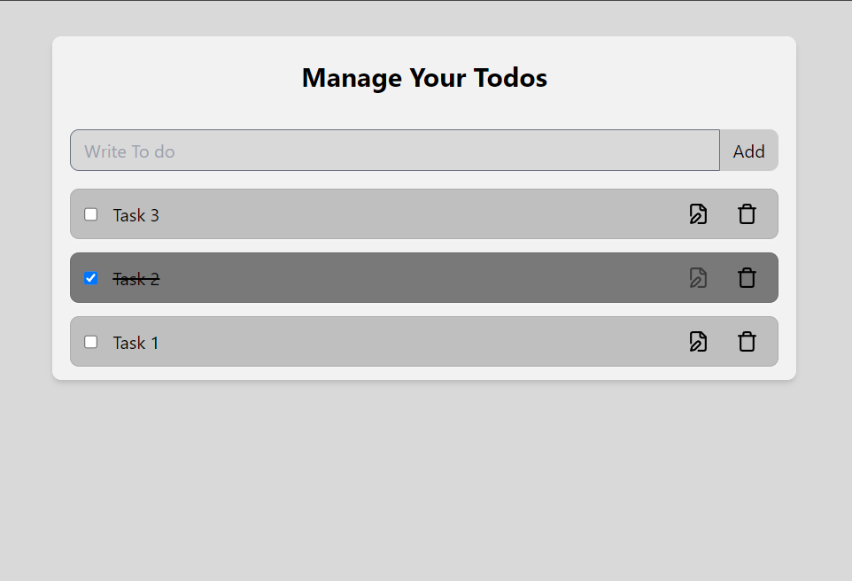

# Todo App with React & Local Storage

This is a simple and efficient Todo app built using React, where tasks are stored locally in the browser using Local Storage. This ensures that your tasks persist even after refreshing or closing the app.

## Features

- **Add Tasks**: Add new tasks with ease.
- **Edit Tasks**: Modify existing tasks.
- **Delete Tasks**: Remove tasks when completed or no longer needed.
- **Local Storage**: Keeps tasks saved in your browser's local storage, ensuring persistence across sessions.
- **Responsive Design**: The app is styled using Tailwind CSS to ensure it works across all screen sizes.

## Tech Stack

- **React**: For building the user interface.
- **Vite**: For fast development and building the app.
- **Tailwind CSS**: For modern and responsive styling.
- **Local Storage**: For saving data persistently in the browser.

## Screenshot


## Installation

1. Clone the repository:
   ```bash
   git clone https://github.com/username/React-Todo-App.git
   cd 10todocontextlocal

2. Install dependencies:
    ```bash
    npm install

3. Run the app in development mode:
    ```bash
    npm run dev

Open http://localhost:5173 to view it in your browser.


## Contributing
Feel free to contribute to the project by opening issues or submitting pull requests.

## License
This project is licensed under the MIT License.

## Contact
If you have any questions or suggestions regarding the project, feel free to reach out!